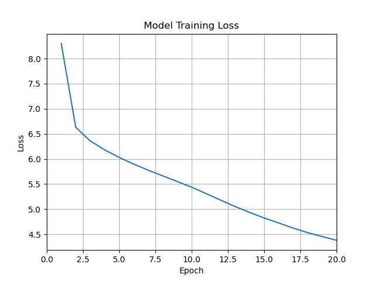

To run DumBot:

Please use the included pyproject.toml to ensure dependencies are met for the included code. This should be as simple as running uv sync (assuming uv is installed).

After this, I have been running my model from a terminal. Both of these files are set up to run everything up until they let you begin talking to the model.

To run the untrained model, use:
    python DumBot_Untrained.py

To run the trained model, use:
    python DumBot.py

The training should take about 5 minutes to complete, and will list progress as completed.

For both of these models, it will show "You:" when it is ready for your input. Just type and enter whatever text you would like to prompt the model with and it will respond. This response will continue from wherever your input leaves off. It will then repeat this until instructed to stop. To do this, simple type "exit" (not case sensitive) when prompted to speak.

Results:

Firstly, here is the loss curve.

You can clearly see a sharp drop in loss for the first couple epochs, however this then begins to smooth out. I cut the training at about 20 epochs, as this took about 5 minutes on my machine, and I did not want the training to take too long. I also noticed that the output at this point had some reasonable outputs. So, while I certainly could get less training loss, I found my parameters adequate for what I want to do.

As a comparison, here are the same prompts fed to the untrained model, then to the trained model.

You:
hello there
Untrained DumBot:
storm straits livst embarks harm sleep brown smothering rallied athletic sleeves contortions applying pinned numbered sleep surest feeling aspersion paine warrant greater bracing stars drench cenotaphs hammocki find veracious crunching slily girth wherewith consorted complies traced ducking expand unpitying moral outstretching worth shower exterminates bolder inventor oars score behead important

You:
hello there
Trained DumBot:
is hammock of so. holloa under passed. the after him! keeping never heard; and it was always we had an excellent it; so the blast; the leak down into it would, and blood and you, cutting small projecting aboard to locks that

You:
white whale
Untrained DumBot:
gale teetering fabulous imperial cleats water bronze bestir sterning course pitchpoled widow compacted tophet goin plasters starry floors longevity probably setall coerced worming hummed offspring end commandingly sovereign replenish britons olive barnacled countenance knowingly canaan alabama sighed spotless snuff describing vivid petrified noisy finny butas styled scornful rob header noting

You:
white whale
Trained DumBot:
, has sailed, at its aunts being read, then recur in as profit another all the sun with the wonder was rolled my immediate despair that i stands his chest at the forecastle much in them, in this of the honor. the frantic it, the

As can be seen here, the trained model is massively better than the untrained. It clearly has some form of structure to what it rights, even though it is still nonsensical. The words have a definite structure to them, and it seems to at least somewhat picking out different parts of speech and stringing them together.

Future Work:
To continue improving this model, I could firstly add more epochs to training to get the most out of the data the mdoel already has. After this, I could add other texts to try to further improve the model.

Functionality-wise, I could implement multiple attention heads to make the model more robust. Additionally, I do not have a CUDA-enabled GPU, but writing the code to run on a GPU would be a useful next step to hopefully make it run faster. 

If I were to implement these suggestions, I would also probably restructure my code so that instead of automatically running everything up until user input, I could run commands to save/load the mode, train it, and generate it when desired.

All contributions by Callum Hood-Cree
